::: zh-CN
## 前言 {lang="zh-CN"}

经过前两篇文章的准备，我们已经了解了黑苹果的基本概念，准备了硬件和OpenCore引导，收集了必要的Kexts和ACPI文件。现在，是时候进入最关键的环节：配置`config.plist`并完成macOS的安装。

## config.plist的重要性 {lang="zh-CN"}

`config.plist`是黑苹果能否成功启动的关键配置文件。它告诉OpenCore如何引导macOS，包括：

1. 系统兼容性设置
2. ACPI和内核补丁
3. 驱动加载顺序
4. 硬件模拟和欺骗

## 详细配置过程 {lang="zh-CN"}

### 工具准备 {lang="zh-CN"}

对于`config.plist`的配置，我强烈推荐使用以下工具：

1. **OCAuxiliaryTools (OCATs)**
   - 跨平台的图形化配置工具
   - 支持实时配置验证
   - 友好的用户界面

2. **ProperTree**
   - 开源的跨平台配置编辑器
   - 适合高级用户手动微调

### 核心配置区域 {lang="zh-CN"}

#### ACPI配置 {lang="zh-CN"}

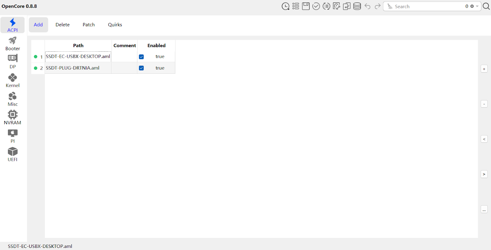

#### Kexts加载配置 {lang="zh-CN"}

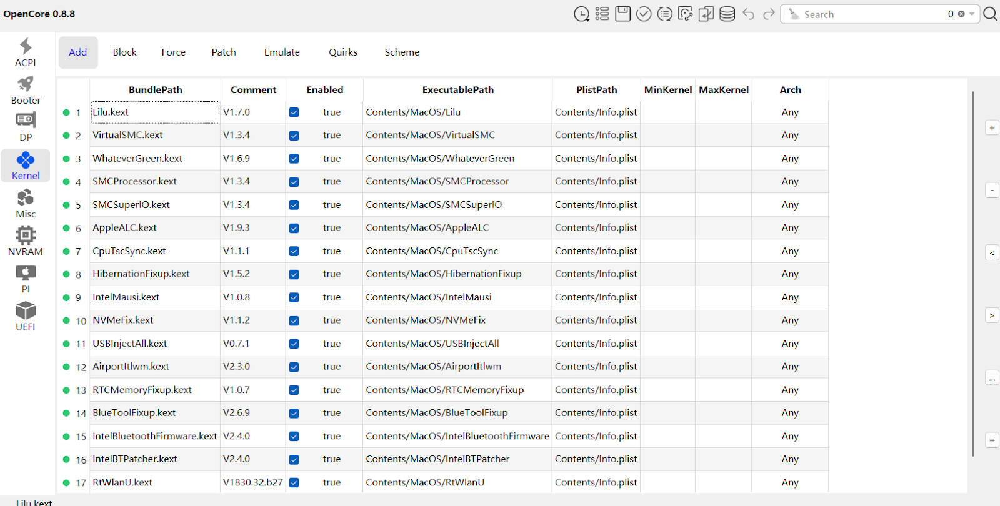

### 特定平台补丁 {lang="zh-CN"}

对于不同的CPU平台，需要添加专门的内核补丁。以下是Skylake平台的示例：

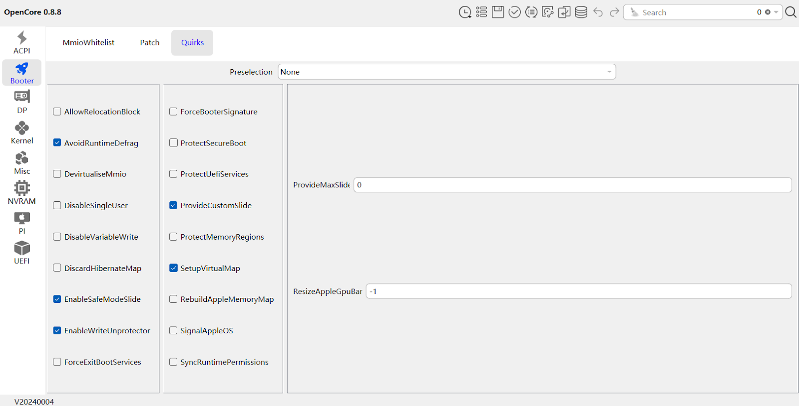
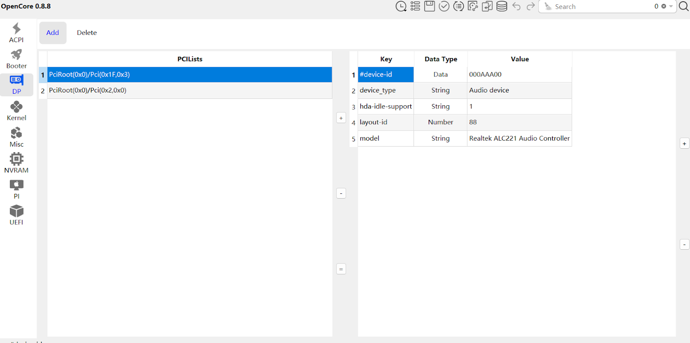
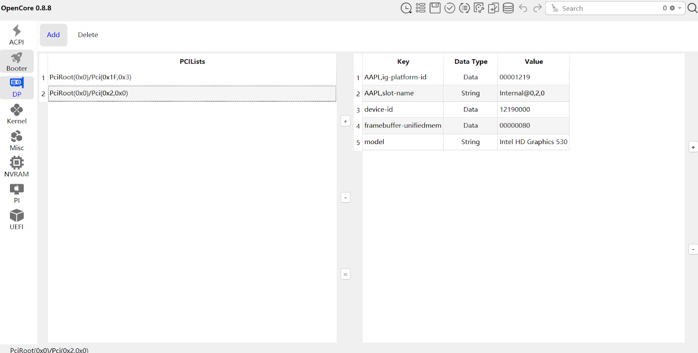
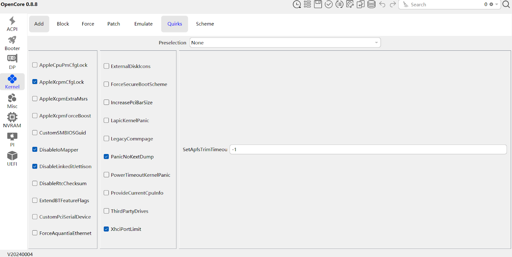
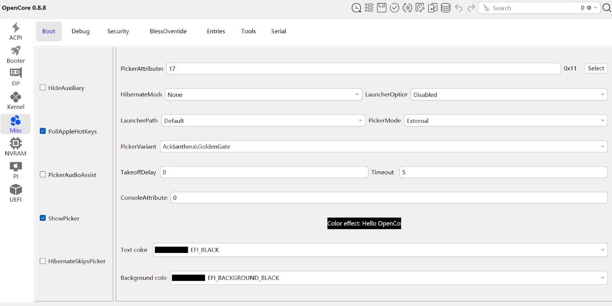
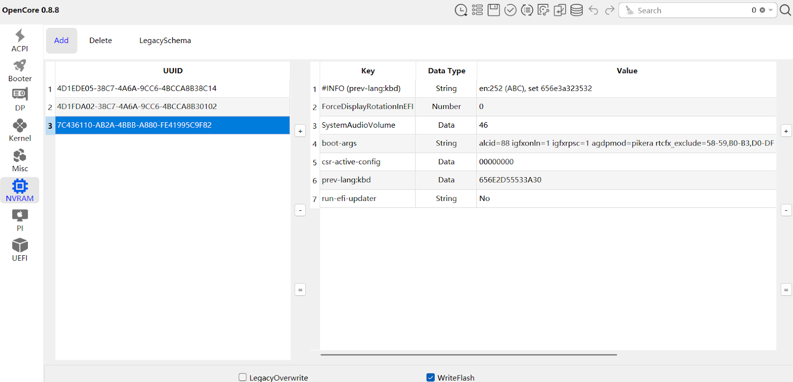
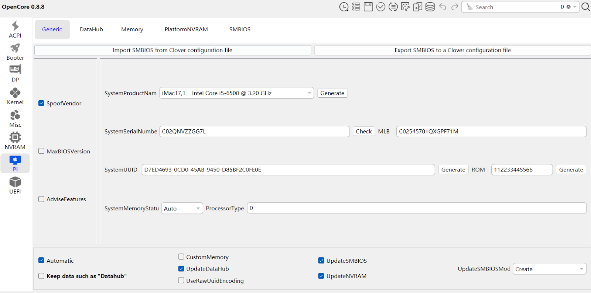
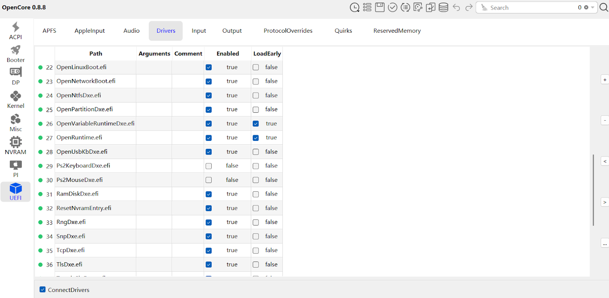
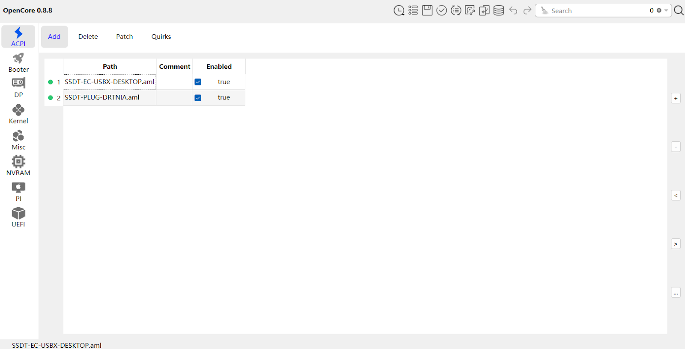

## 启动介质准备 {lang="zh-CN"}

### 获取macOS镜像 {lang="zh-CN"}

准备macOS安装镜像有多种方法：

1. **App Store下载**
    - 直接从苹果应用商店下载最新版本
    - 仅限于已经拥有Mac设备的用户

2. **第三方工具**
    - `gibMacOS`
    - `OpenCore官方下载工具`

3. **Google搜索.raw镜像文件**
    - 可以找到预先准备好的macOS .raw 镜像
    - 适用于无法使用官方下载方式的用户

### 制作启动U盘 {lang="zh-CN"}

推荐使用以下方法：

1. **macOS原生方法**
   ```bash
   sudo /Applications/Install\ macOS\ Big\ Sur.app/Contents/Resources/createinstallmedia --volume /Volumes/MyVolume
   ```

2. **跨平台工具**
   - `balenaEtcher`

3. **写入 OpenCore EFI**
    - 在 Windows 或 Linux 上，将 EFI 文件夹复制到 U 盘的 EFI 分区
    - 在 macOS 上，可使用 mount 挂载 EFI 分区后复制文件

## 安装流程 {lang="zh-CN"}

1. 插入OpenCore引导U盘
2. 进入BIOS，调整启动顺序
3. 选择OpenCore引导
4. 选择macOS安装选项
5. 分区并安装系统
6. 根据提示完成初始设置

## 故障排除 {lang="zh-CN"}

### 常见问题 {lang="zh-CN"}

1. **卡在苹果logo**
   - 检查config.plist配置
   - 尝试不同的引导参数
   - 调整ACPI补丁

2. **硬件未识别**
   - 确认Kexts是否正确加载
   - 检查驱动兼容性
   - 更新或替换特定Kext

3. **性能问题**
   - 调整电源管理设置
   - 优化Kexts配置
   - 检查CPU和GPU补丁

## 推荐资源 {lang="zh-CN"}

1. [Dortania OpenCore指南](https://dortania.github.io/OpenCore-Install-Guide/)
2. [tonymacx86论坛](https://www.tonymacx86.com/)
3. [Hackintosh Reddit社区](https://www.reddit.com/r/hackintosh/)

## 结语 {lang="zh-CN"}

黑苹果是一个不断学习和调整的过程。保持耐心，仔细研究，相信你终将成功！
:::

::: en
## Introduction {lang="en"}

After preparing in the previous two articles, we have understood the basic concept of Hackintosh, prepared hardware and OpenCore boot, and collected necessary Kexts and ACPI files. Now, it's time to enter the most critical phase: configuring `config.plist` and completing macOS installation.

## Importance of config.plist {lang="en"}

`config.plist` is the key configuration file for successful Hackintosh booting. It tells OpenCore how to boot macOS, including:

1. System compatibility settings
2. ACPI and kernel patches
3. Driver loading order
4. Hardware emulation and spoofing

## Detailed Configuration Process {lang="en"}

### Tool Preparation {lang="en"}

For `config.plist` configuration, I strongly recommend the following tools:

1. **OCAuxiliaryTools (OCAts)**
   - Cross-platform graphical configuration tool
   - Supports real-time configuration verification
   - User-friendly interface

2. **ProperTree**
   - Open-source cross-platform configuration editor
   - Suitable for advanced users for manual fine-tuning

### Core Configuration Areas {lang="en"}

#### ACPI Configuration {lang="en"}


#### Kexts Loading Configuration {lang="en"}


### Platform-Specific Patches {lang="en"}

For different CPU platforms, specific kernel patches need to be added. Here's an example for the Skylake platform:


## Installation Media Preparation {lang="en"}

### Obtaining macOS Image {lang="en"}

There are multiple ways to prepare the macOS installation image:

1. **App Store Download**
    - Directly download the latest version from the Apple App Store
    - Limited to users who already own a Mac device

2. **Third-Party Tools**
    - `gibMacOS`
    - `OpenCore Official Download Tool`

3. **Google the .raw image file**
    - Search for pre-prepared macOS .raw images
    - Useful for users who cannot use official download methods

### Creating Bootable USB {lang="en"}

Recommended methods:

1. **macOS Native Method**
   ```bash
   sudo /Applications/Install\ macOS\ Big\ Sur.app/Contents/Resources/createinstallmedia --volume /Volumes/MyVolume
   ```

2. **Cross-Platform Tools**
   - `balenaEtcher`

3. **Writing OpenCore EFI**
    - On Windows or Linux, copy the EFI folder to the EFI partition of the USB drive
    - On macOS, mount the EFI partition and copy the EFI files

## Installation Process {lang="en"}

1. Insert OpenCore boot USB
2. Enter BIOS, adjust boot order
3. Select OpenCore boot
4. Choose macOS installation option
5. Partition and install system
6. Complete initial setup according to prompts

## Troubleshooting {lang="en"}

### Common Issues {lang="en"}

1. **Stuck at Apple Logo**
   - Check config.plist configuration
   - Try different boot parameters
   - Adjust ACPI patches

2. **Hardware Not Recognized**
   - Verify correct Kexts loading
   - Check driver compatibility
   - Update or replace specific Kexts

3. **Performance Issues**
   - Adjust power management settings
   - Optimize Kexts configuration
   - Check CPU and GPU patches

## Recommended Resources {lang="en"}

1. [Dortania OpenCore Guide](https://dortania.github.io/OpenCore-Install-Guide/)
2. [tonymacx86 Forums](https://www.tonymacx86.com/)
3. [Hackintosh Reddit Community](https://www.reddit.com/r/hackintosh/)

## Conclusion {lang="en"}

Hackintosh is a continuous learning and adjustment process. Stay patient, study carefully, and you will eventually succeed!
:::